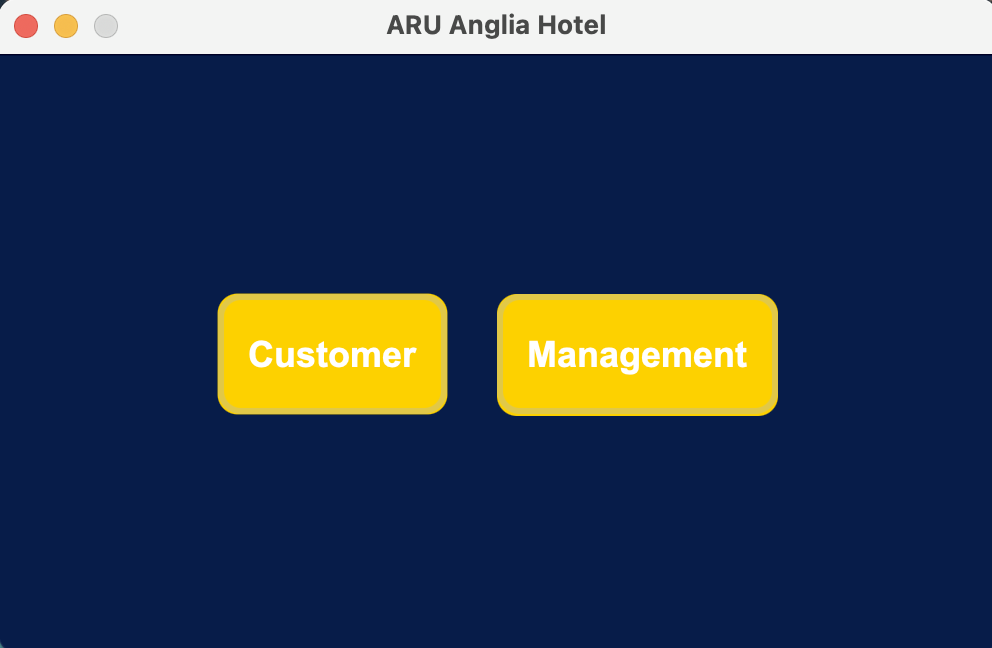
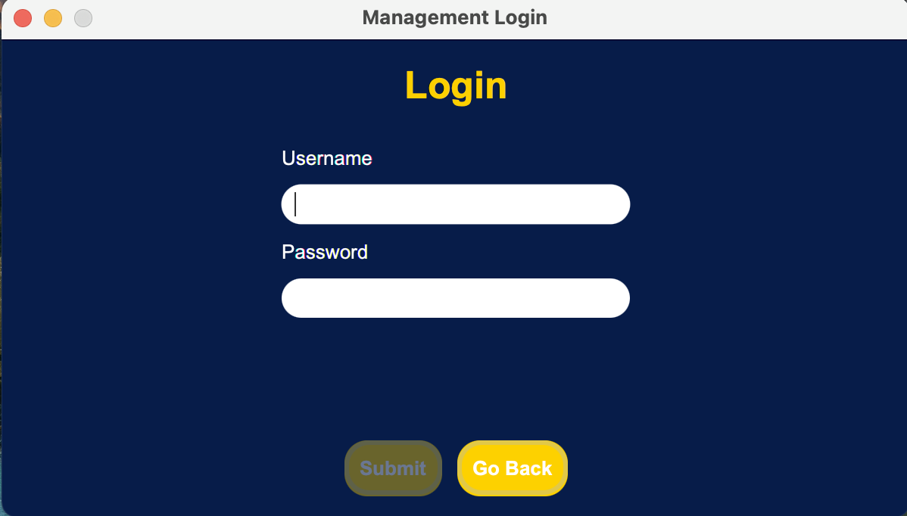
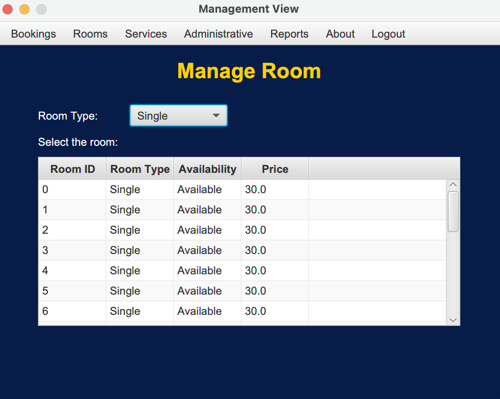

# ARU-AngliaHotel

ARU Hotel System

## Getting Started

Case of study to an assignment to the University Module Object Oriented Programming.

## Specifications

This project was built in case of study for a university modyle assignment and the student was required to buld a hotel management system where a customer can place a new booking, selecting an available room. There is a management side as well where the manager or a staff could login and proceed to checkin, checkout and payment and the manager could add new services to the customer bill as well.

The student was required to build an extended ERD model normalising it at the end.

## Images

## Built With

- Java
- JavaFX
- JDBC
- PostgreSQL
- Relational Database Design
- JavaFX CSS

## Contributing

Feel free to download it and improve it. If you want just give a pull request with your changes and let me know what can be improved. Many thanks :D

## Pages

- [GitHub Page](https://github.com/BitInByte)
- [Instagram](https://www.instagram.com/bitinbyte/)
- [Twitter](https://twitter.com/BitInByte2)

## Authors

**BitInByte** - Development student and tech enthusiastic
